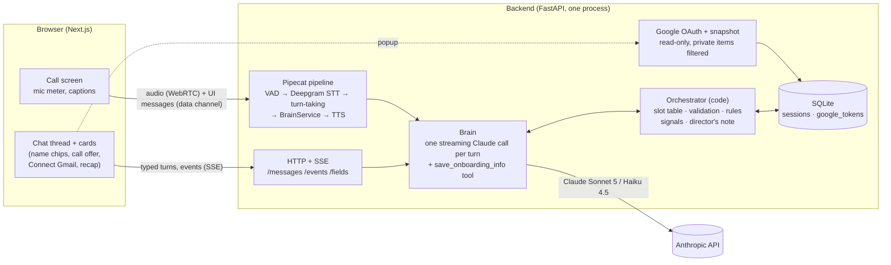

# Architecture and decisions

## The shape of it

**One brain, two channels.** Typed messages and transcribed speech become the same kind of turn, go to the same model with the same prompt and the same history, and produce the same state changes. Only the edges differ: SSE for text; WebRTC audio plus a data channel for the call. That's what makes a hangup continue seamlessly over text, and what lets the evals test calls in text.

**The model handles language; code handles control flow.** Hybrid open slot filling (mixed-initiative, frame-based dialogue management):

| Code owns | The model owns |
|---|---|
| The slot table and every rule (graduation, cooldowns, stall detection) | Understanding messy, out-of-order, multi-part answers |
| Validation of every value the model saves | Deciding what to save (via one tool call) |
| Deterministic cues: rushed/frustrated, "skip the setup", a clear no to Gmail | Reading everything subtler |
| Events: calls, hangups, silence, Gmail, resume, recap edits | Wording: warm, varied, never scripted |
| The director's note each turn | Following the note naturally |

## A turn, end to end

1. Input arrives: typed text, a finished spoken turn (after Smart Turn decides you're done), or an app event (`[event: the call dropped]`).
2. Code updates signals (short-answer streaks, mood and skip cues), neutralizes anything in user text that looks like a control tag, and writes the **director's note**: filled, missing, signals, graduation status, priority, reply length, and (when relevant) the account snapshot.
3. The note is appended to the newest user message, so the system prompt and tool schema stay a byte-stable, cached prefix (~4k tokens read from cache per turn).
4. Claude streams its reply and calls `save_onboarding_info` when it learns something. Text streams to the browser, or to TTS word by word.
5. Code validates each field, updates state, emits UI events (show the call offer, ring, show the Gmail card, graduate).
6. The tool result is deferred to the start of the next user message, so a normal turn is **one** model call. A second call happens only if the model saved something without speaking or a value was rejected.

## Decisions (and why)

| Decision | Why | Alternative considered |
|---|---|---|
| Cascaded voice (STT → LLM → TTS) | One brain for voice and text; any TTS voice; every turn is readable text, so it's testable | Speech-to-speech (OpenAI Realtime, Gemini Live): hears tone natively and is a bit faster, but it would be a second, different brain on the call (Claude has no speech-to-speech model) |
| Pipecat, with our brain as a custom processor | Pipecat owns audio, WebRTC, VAD and turn-taking; our orchestrator stays in charge of the conversation | Pipecat's stock LLM service: would hand control flow to the framework |
| Browser ↔ server WebRTC (SmallWebRTC) | No room service or phone numbers for reviewers; the Gmail card can appear mid-call | Daily/LiveKit rooms, Twilio: more vendors, more setup |
| Director's note at the end of the user message | Keeps the cached prefix stable; gives code a steering wheel every turn | Mid-conversation system messages: not supported on Sonnet 5 |
| Tool call inside the main response | No extra latency; model talks and saves in one pass | Separate extraction pass (+300 ms), JSON-then-speech (delays audio) |
| `gmail.metadata` scope | Headers only: "we never read your email" is enforced by Google, not promised | `gmail.readonly`: reads bodies, restricted-scope review |
| Calendar writes are propose → confirm card → user tap | "Nothing happens without your yes" enforced by code: the model can only propose; the server writes only on the tap | Letting the model call the Calendar API directly |
| Snapshot once, filtered in code | Short, cheap notes; medical/financial/private items never reach the model | Live Gmail queries per turn: slower, more surface area |
| Only the OAuth callback can mark Gmail connected; browser polls | A client can't claim a connection; Google's COOP headers break popup→opener messaging | Trusting a postMessage from the popup |
| Deterministic guarantees for skip, Gmail refusal, user-intent fields | Things users must never repeat shouldn't depend on the model remembering | Prompt-only |
| SQLite, one JSON document per session | Survives restarts and refreshes; zero ops | Postgres: unnecessary at this scale |

## Latency budget (measured)

| Stage | Target | Measured |
|---|---|---|
| End of turn (Smart Turn v3) | 200–400 ms confident; cap when unsure | instant when confident; capped at 1.2 s (was Pipecat's 3 s default) |
| LLM first token | 300–600 ms | Haiku 4.5 ~520–670 ms · Sonnet 5 ~900–1,000 ms |
| TTS first audio | 100–200 ms | Cartesia 145–270 ms |
| **End of turn → first audio** | ~1 s | **Haiku ~0.98 s median** · Sonnet ~1.66 s |

Every voice turn is logged to `backend/data/latency.jsonl`.

## Engineering log: real bugs found, and how

Most of these only showed up by testing the real thing: live calls, a real Mac, real Google, and simulated adversarial users.

| Bug | How it was found | Fix |
|---|---|---|
| UI events never reached the browser: `{"type": "ui", **ev}` let the event's own `type` overwrite `"ui"` | Writing the first test | Nest the payload under `ui` |
| The voice pipeline couldn't reach Deepgram/Cartesia: `CERTIFICATE_VERIFY_FAILED` | A real call on macOS (python.org Python ships without root CAs) | Point `SSL_CERT_FILE` at certifi at startup |
| The agent's voice was never played | Real call: the WebRTC client reports the bot track with no participant, and the player required one | Play any audio track that isn't the local mic |
| The call went silent after an interruption: a **deadlock** (the barge-in trim awaited the session lock inside a pipeline handler while the next turn held that lock and pushed frames through the same pipeline) | Real call; reproduced by the automated WebRTC caller | Run the trim as a separate task |
| Replies took ~4.5 s: Smart Turn judged most real finished sentences "incomplete" and waited its 3 s silence cap | Reading turn-detector logs from a real call | Cap uncertain waits at 1.2 s |
| `.env` inline comments became values (`TTS_MODEL="# optional"`) | Cartesia returned `model_not_found` | Comments on their own lines; config ignores `#…` values |
| "Mhm" while the agent talked was glued onto the next turn | Automated caller + reading the history | Strip leading backchannels at the brain boundary |
| A hangup counted as a barge-in and erased the text follow-up | Reading the history after a test call | Trim only the exact voice turn, never while the call is ending |
| A stale timer revived a call that had already hung up | Restarting the server mid-call | Guard the timer and the `call_connected` event |
| The model ended its own call after offering to switch to text | Haiku during a silence check-in | User-intent fields can only be set on a turn where the user spoke |
| Calendar times in the server's timezone | Code review ahead of deployment | Browser sends its IANA timezone |
| A model claimed it could read full email bodies | Eval: privacy-skeptic persona | Precise data-access facts in the prompt |

## Evals

`backend/evals/`: 13 simulated users (Claude Haiku 4.5 playing the rushed exec, rambler, privacy skeptic, joker, jailbreaker, …) drive the real brain through the same event paths as the app; code checks the facts and Claude Opus 5 judges the rest against the spec. Results and the round-by-round history are in the README; every transcript is in `backend/evals/results/`.
